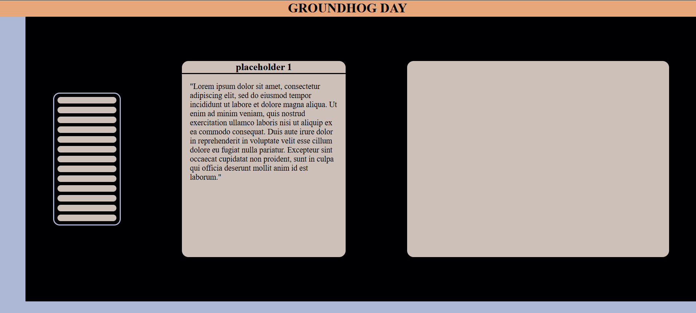
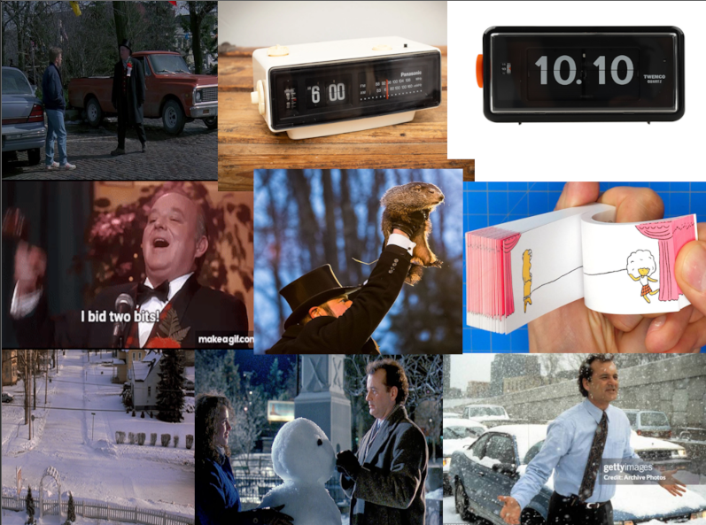

# GroundHogDay

## watched the movie

### movie description

I have watched the groundhog day movie, its about a newsreporter named Phill going to a small town that celebrate Groundhog day.
Phil hates this town and want to leave as soon as possible. After being forced to stay in town because of a blizzard.
Phil wakes up again on groundhog day. Now he stuck in an timeloop to repeat the sameday over and over again.

---

## Design concept

Current concept of the website is an old clock that appears in the movie. The clock has design of flipping though pages. 
But the website version of the clock has the explanation of the moment with an picture.

---

## progressie verslag

### Monday 3 March

Vandaag ben ik begonnen met het maken van mijn clock, ik gebruikte deze tijd om CSS nesting te leren en te experimenteren met Container Queries.
After 2 hours i got something like this.

And personaly I was unhappy with it. Constantly trying to fix it but with picture I used made it more difficult.

So scrapped it for now and am working on making an mood board. I started with using this picture.

And i will continue tommorwow

### Tuesday 4 March

I started by using the poster as and example for what kind of scene i want to make. and got something like this.

While it was a start i felt like I was going to far away from the origanal concept. So I went looking for an proper picture of the clock. With that picture I made an inspiration collage

In the end of the day I made this.

I want to work on the flipping function next monday. Something simular to this

https://cdn.dribbble.com/userupload/20966336/file/original-3312831bc9bc08504d6d7da34b970202.gif

After i get the flipping animation right and functional. I'll write down how i tell the story.

### Monday

### Tuesday