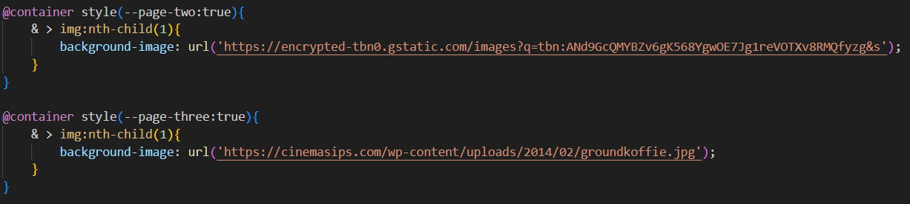
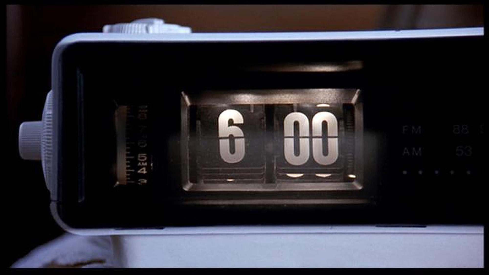
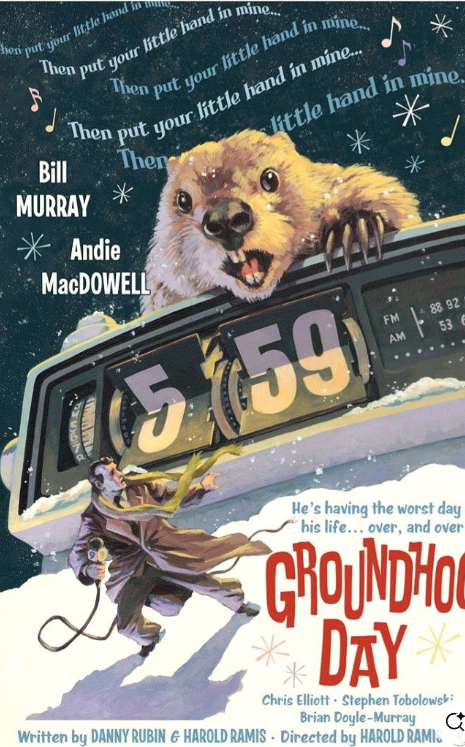
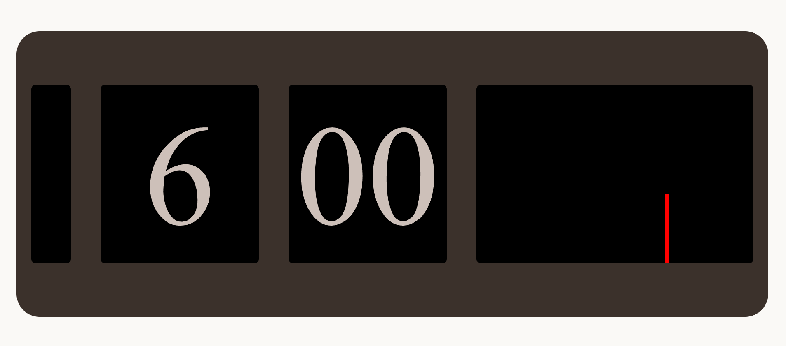

# GroundHogDay

## watched the movie

### movie description

I have watched the groundhog day movie, its about a newsreporter named Phill going to a small town that celebrate Groundhog day.
Phil hates this town and want to leave as soon as possible. After being forced to stay in town because of a blizzard.
Phil wakes up again on groundhog day. Now he stuck in an timeloop to repeat the sameday over and over again.

---

## Design concept

Current concept of the website is an old clock that appears in the movie. The clock has design of flipping though pages. 
But the website version of the clock has the explanation of the moment with an picture.

---

## progressie verslag

### Monday 3 March

Vandaag ben ik begonnen met het maken van mijn clock, ik gebruikte deze tijd om CSS nesting te leren en te experimenteren met Container Queries.
After 2 hours i got something like this.

And personaly I was unhappy with it. Constantly trying to fix it but with picture I used made it more difficult.

So scrapped it for now and am working on making an mood board. I started with using this picture.

And i will continue tommorwow

### Tuesday 4 March

I started by using the poster as and example for what kind of scene i want to make. and got something like this.

While it was a start i felt like I was going to far away from the origanal concept. So I went looking for an proper picture of the clock. With that picture I made an inspiration collage

In the end of the day I made this.

I want to work on the flipping function next monday. Something simular to this

https://cdn.dribbble.com/userupload/20966336/file/original-3312831bc9bc08504d6d7da34b970202.gif

After i get the flipping animation right and functional. I'll write down how i tell the story.

### Monday 16 march

Taking inspiration from an fellow student wanted to try to make my clock 3d. I decided to follow the tutorial that was recomanded from Sanne. And I dind't undestand, and after trying mulitple tutorials.

So I decided to try with Chat gpt. (Not my proudest moment). It was able to make the box shape. I started with this so i could understand the cube making process.

So trying to convert the CSS to be able to without used without ID and CLASSES. And with the final result i created the cube CSS with just CSS nesting.

### Tuesday 17 march

Today I wanted to turn the cube into an rectangular shape. and adding pictures to the faces pictures and a clock shape. 

Turning the clock retangular is a little anoying but i by adjusting the postion of the left and right faces it was possible.

Adjusting the faces to show images was als possible using Style queries.

With this i can change the pages of the clock with button click and the position of the Clock to make it more interactive.

#### monday 17 march

I have added the Radio function Sanne talked about and started using it as an header with an big button.

## Retake of the css asignment

So i failed it before I took 4 improvments points. 

1. CSS nesting can be beter with tittle and text. I don't need so much nesting.
2. I should make the clock beter with more cubes. and add a flipping animation.
3. I need to make the clock more responsive the text is not responsive and the clock is not responsive.
4. background color is random changed it related to the scene.

So here is what i was able to improve and what wasn't possible to improve. Maybe if i had asked the teacher for help i could have made it better. But i was to busy with the other projects.

1. The nesting is better but not perfect. I listened to the feedback and made the nesting better. I have used the same trick I gotten from Sanne to text. Improved.
2. The clock was not able to be improved. I was not able to make the clock better. I have tried to make it better but I couldn't make the cubes fit right and it made the cube look worse. the flipping animation was made but I couldn't make the animation retrigger. I could only trigger once. I have tried to make it trigger again and again but it didn't
3. The clock is now way more responsive. First I would like to thank you for the text sizing. I also made the phone size look a bit better. I then started experimenting with the clock and background colors. I decided that background colors changing was nice and wanted it to be visible even in phone mode.
4. Background color are matching the scene. yeah honestly 5 min work its not perfect match but I tried to make it feel like the picture i was using. except for where the protrag riding with the animal. I used red for 1 reason. the car he was in is red but you can't see it in the picure.

What I learnd. That I should have asked for help earlier. Its not a shame to ask for help. I also learned a bit more with nesting and animation even though the aniamtion did not work properly.